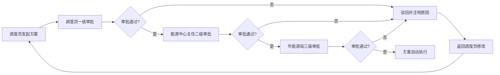

## 1. 产品概述

3D智慧城市综合能源（电热气）协同调度与应急联动可视化平台，面向城市能源管理部门，提供电网、热力网、燃气网的一体化三维可视化监控与智能调度能力。平台通过3D城市模型实时展示能源基础设施运行状态，实现多能互补协同调度、智能预警与应急联动、三级审批流程管理，全面提升城市能源系统的安全运行水平和应急处置效率。

- 核心价值：实现电/热/气多能系统可视化协同管理，提升调度决策效率与应急响应速度
- 目标用户：值班员、调度员、能源中心主任、市能源局管理人员

## 2. 核心功能

### 2.1 用户角色

| 角色 | 登录方式 | 核心权限 |
|------|----------|----------|
| 值班员 | 人脸识别 | 查看监控大屏、上报异常事件 |
| 调度员 | 人脸识别 | 查看监控、生成调配方案、启动应急预案、一级审批 |
| 能源中心主任 | 人脸识别 | 全部调度权限、二级审批、导出报表 |
| 市能源局 | 人脸识别 | 全局查看、三级审批、历史数据追溯 |

### 2.2 功能模块

1. **登录认证页**：人脸识别登录界面、角色选择、登录日志记录
2. **3D监控主界面**：城市3D模型、能源站展示、能量流向动画、实时状态面板
3. **能源站详情弹窗**：24小时出力曲线图、故障记录列表、运行参数明细
4. **负荷预测与多能互补面板**：未来24小时负荷预测、自动生成互补方案、方案执行状态
5. **预警与应急联动中心**：实时预警列表、超限区域高亮、备用能源切换动画、预警推送
6. **管网泄露检测与抢修调度**：泄漏点红色球体标注、抢修路径动画、工单派发状态
7. **三级审批调度大屏**：审批流程进度条、待审/已审列表、审批意见输入
8. **能源日报导出中心**：日期选择、报表预览、Excel导出下载

### 2.3 页面详情

| 页面名称 | 模块名称 | 功能描述 |
|----------|----------|----------|
| 登录认证页 | 人脸识别区域 | 摄像头画面展示、人脸识别进度条、识别成功/失败提示 |
| 登录认证页 | 角色信息展示 | 用户姓名、角色、所属部门、登录时间记录 |
| 3D监控主界面 | 3D城市场景 | 可旋转缩放的3D城市、能源站模型、管网线路 |
| 3D监控主界面 | 能源站状态标签 | 编号、实时出力、负荷率、运行状态（绿/黄/红） |
| 3D监控主界面 | 能量流向动画 | 不同颜色流动箭头：电(蓝)/热(橙)/气(绿) |
| 3D监控主界面 | 顶部数据概览栏 | 总发电量、总供热量、总供气量、系统负荷率 |
| 3D监控主界面 | 侧边功能面板 | 负荷预测、预警中心、审批中心、报表导出入口 |
| 能源站详情弹窗 | 24小时出力曲线 | SVG/Canvas折线图、支持电/热/气切换、峰值标注 |
| 能源站详情弹窗 | 故障记录列表 | 时间、类型、级别、处置状态、处置人 |
| 负荷预测面板 | 天气预报展示 | 温度、湿度、风速、天气图标 |
| 负荷预测面板 | 24小时负荷预测图 | 柱状图+折线图、历史对比曲线 |
| 负荷预测面板 | 多能互补方案 | 方案列表（热泵蓄热/燃气调峰等）、执行按钮 |
| 预警与应急中心 | 预警列表 | 预警级别、区域、类型、触发时间、处置状态 |
| 预警与应急中心 | 3D高亮联动 | 超限建筑变红闪烁、备用能源站切换动画 |
| 管网泄露检测 | 泄漏点标注 | 红色脉冲球体、位置信息、压力数据 |
| 管网泄露检测 | 抢修路径动画 | 蓝色动态路径、抢修队位置、预计到达时间 |
| 三级审批大屏 | 流程进度展示 | 调度员→主任→市局三级进度条、当前节点高亮 |
| 三级审批大屏 | 审批操作区 | 审批意见输入、通过/驳回按钮、审批历史记录 |
| 能源日报导出 | 日期选择器 | 支持单日/日期范围选择 |
| 能源日报导出 | 报表预览 | 各能源站出力/负荷率表格、应急事件统计 |

## 3. 核心流程

### 3.1 日常监控调度流程

调度员通过人脸识别登录系统 → 进入3D监控大屏查看全城市能源运行状态 → 点击能源站查看详细数据和曲线 → 系统自动生成多能互补方案 → 调度员发起调配方案审批 → 三级审批完成后自动执行 → 能量流向动画实时更新

### 3.2 应急处置流程

系统检测到负荷超限/管网压力异常/燃气泄漏 → 触发预警推送（声音+弹窗）→ 3D场景中对应区域变红闪烁 → 自动启动备用能源/定位泄漏点 → 生成抢修工单并派发最近抢修队 → 抢修路径动画展示 → 调度员确认处置 → 记录到应急事件统计

### 3.3 审批流程

## 4. 用户界面设计

### 4.1 设计风格

- **主色调**：深空蓝 (#0A1628) 为背景主色，科技蓝 (#00D4FF) 为主题色
- **辅助色**：电力蓝 (#1E90FF)、热力橙 (#FF6B35)、燃气绿 (#00C48C)、预警红 (#FF3B5C)、安全绿 (#00E676)
- **字体**：数字使用 "Orbitron" 科技感字体，中文使用 "PingFang SC" 配合 "Noto Sans SC"
- **视觉风格**：赛博朋克科技风、霓虹发光效果、HUD仪表盘样式、毛玻璃半透明面板
- **动效**：呼吸灯、脉冲光晕、粒子流光、3D旋转过渡

### 4.2 页面设计概览

| 页面名称 | 模块名称 | UI元素设计 |
|----------|----------|------------|
| 登录页 | 人脸识别框 | 六边形扫描框、绿色扫描线动画、四角装饰角标 |
| 登录页 | 背景 | 深蓝粒子流动背景、能源网络连线动画 |
| 3D监控大屏 | 主场景 | 黑色星空背景、城市建筑科技蓝描边、发光管道 |
| 3D监控大屏 | 状态标签 | 悬浮HUD面板、边框发光、箭头指向对应模型 |
| 3D监控大屏 | 顶部概览 | 毛玻璃面板、实时数字滚动动画、迷你趋势图 |
| 详情弹窗 | 曲线图表 | 渐变填充折线图、数据点发光、Tooltip悬浮提示 |
| 预警中心 | 预警条目 | 左侧彩色级别条、闪烁红点、时间轴样式 |
| 审批大屏 | 进度条 | 三段式发光进度条、节点脉冲光环、状态颜色变化 |

### 4.3 响应式设计

- 桌面端优先（调度大屏 1920×1080 及以上）
- 支持 2K/4K 高清大屏自适应缩放
- 侧边面板支持收起/展开，最大化3D可视区域
- 触摸设备支持手势旋转、缩放3D场景

### 4.4 3D场景设计指南

- **环境氛围**：夜晚城市风格、深蓝色雾效、星空粒子背景、霓虹发光建筑边缘
- **光照设置**：平行光模拟月光 + 各能源站彩色点光源 + 半球光环境补光
- **相机设置**：初始45°俯视角度、OrbitControls支持自由旋转/缩放/平移、限制最小最大距离
- **焦点元素**：能源站模型添加发光边框和脉冲光晕，管道添加流动材质
- **交互方式**：点击模型弹出详情面板、Hover高亮描边、双击聚焦放大
- **后处理效果**：Bloom泛光效果、轻微景深、色调映射提升科技感
- **性能优化**：建筑使用实例化渲染、LOD层级、合理控制面数
