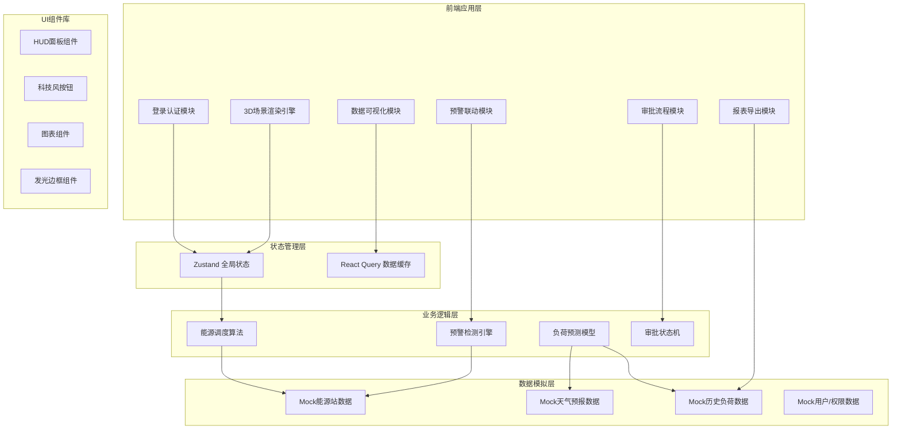

## 1. 架构设计



## 2. 技术选型说明

- **前端框架**：React@18 + TypeScript@5
- **构建工具**：Vite@5
- **样式方案**：TailwindCSS@3 + 自定义CSS变量
- **3D渲染**：Three.js@0.160 + @react-three/fiber@8 + @react-three/drei@9
- **3D后处理**：@react-three/postprocessing@2
- **状态管理**：Zustand@4
- **数据请求**：React Query@5（用于缓存模拟数据）
- **图表库**：Recharts@2（React图表组件）
- **UI图标**：Lucide React
- **Excel导出**：xlsx (SheetJS)
- **动画库**：Framer Motion（UI过渡动画）
- **后端**：无（纯前端Mock数据演示）

## 3. 路由定义

| 路由路径 | 页面组件 | 用途说明 |
|----------|----------|----------|
| /login | LoginPage | 人脸识别登录页面 |
| /dashboard | DashboardPage | 3D监控主界面（调度大屏） |
| /approval | ApprovalPage | 三级审批调度大屏 |
| /report | ReportPage | 能源日报导出中心 |

## 4. 核心数据模型（TypeScript类型）

```typescript
// 能源站类型
type EnergyStationType = 'substation' | 'heat_station' | 'gas_station' | 'storage_station' | 'building';

// 能源站基础信息
interface EnergyStation {
  id: string;
  code: string;              // 编号
  name: string;
  type: EnergyStationType;
  position: { x: number; y: number; z: number };  // 3D坐标
  status: 'normal' | 'warning' | 'critical' | 'offline';  // 运行状态
  realtimeOutput: number;    // 实时出力 (MW / 吨 / m³)
  maxOutput: number;         // 最大出力
  loadRate: number;          // 负荷率 (%)
  isBackupActive: boolean;   // 备用能源是否启用
}

// 负荷数据点
interface LoadDataPoint {
  time: string;       // HH:mm
  electricity: number;
  heat: number;
  gas: number;
  predicted?: boolean;  // 是否为预测值
}

// 故障/事件记录
interface EventRecord {
  id: string;
  stationId: string;
  time: string;
  type: 'fault' | 'warning' | 'maintenance' | 'emergency';
  level: 1 | 2 | 3;    // 1=一般 2=重要 3=紧急
  description: string;
  handler: string;
  status: 'pending' | 'processing' | 'resolved';
}

// 预警信息
interface Alert {
  id: string;
  type: 'load_overrun' | 'pressure_overrun' | 'gas_leak' | 'equipment_fault';
  area: string;
  stationId?: string;
  level: 1 | 2 | 3;
  triggeredAt: string;
  message: string;
  resolved: boolean;
  location?: { x: number; y: number; z: number };
}

// 多能互补方案
interface ComplementaryPlan {
  id: string;
  name: string;
  description: string;
  type: 'heat_pump_storage' | 'gas_booster_peak' | 'battery_discharge' | 'grid_transfer';
  triggerCondition: string;
  expectedEffect: string;
  status: 'pending' | 'approved_level1' | 'approved_level2' | 'executing' | 'completed' | 'rejected';
  approvals: ApprovalRecord[];
}

// 审批记录
interface ApprovalRecord {
  level: 1 | 2 | 3;
  approver: string;
  role: string;
  action: 'approve' | 'reject' | 'pending';
  comment: string;
  time: string;
}

// 抢修工单
interface RepairOrder {
  id: string;
  alertId: string;
  leakLocation: { x: number; y: number; z: number };
  teamId: string;
  teamName: string;
  teamLocation: { x: number; y: number; z: number };
  path: { x: number; y: number; z: number }[];
  status: 'dispatched' | 'enroute' | 'arrived' | 'repairing' | 'completed';
  eta: string;
  createdAt: string;
}

// 用户角色
type UserRole = 'operator' | 'dispatcher' | 'director' | 'bureau';

interface User {
  id: string;
  name: string;
  role: UserRole;
  department: string;
  avatar: string;
  lastLogin: string;
}

// 能源日报数据
interface DailyReport {
  date: string;
  stations: {
    stationId: string;
    stationCode: string;
    stationName: string;
    totalOutput: number;
    avgLoadRate: number;
    maxLoadRate: number;
    runtimeHours: number;
  }[];
  emergencyEvents: {
    time: string;
    type: string;
    area: string;
    description: string;
    resolution: string;
  }[];
  summary: {
    totalElectricity: number;
    totalHeat: number;
    totalGas: number;
    avgSystemLoadRate: number;
    peakLoad: number;
    eventCount: number;
  };
}
```

## 5. 项目目录结构

```
src/
├── components/
│   ├── 3d/                    # 3D场景相关组件
│   │   ├── CityScene.tsx      # 城市主场景
│   │   ├── EnergyStation3D.tsx # 能源站3D模型
│   │   ├── FlowArrows.tsx     # 能量流动箭头
│   │   ├── Pipeline3D.tsx     # 管网3D模型
│   │   ├── LeakMarker.tsx     # 泄漏点标注
│   │   └── RepairPath.tsx     # 抢修路径动画
│   ├── ui/                    # 通用UI组件
│   │   ├── HUDPanel.tsx       # HUD面板容器
│   │   ├── GlowButton.tsx     # 发光按钮
│   │   ├── StatusBadge.tsx    # 状态标签
│   │   ├── DataNumber.tsx     # 滚动数字
│   │   └── ScanFrame.tsx      # 扫描框（人脸识别）
│   ├── charts/                # 图表组件
│   │   ├── OutputChart.tsx    # 出力曲线图
│   │   ├── LoadForecast.tsx   # 负荷预测图
│   │   └── ApprovalProgress.tsx # 审批进度条
│   ├── panels/                # 侧边面板
│   │   ├── TopOverview.tsx    # 顶部概览栏
│   │   ├── StationDetail.tsx  # 能源站详情弹窗
│   │   ├── ForecastPanel.tsx  # 负荷预测面板
│   │   ├── AlertCenter.tsx    # 预警中心
│   │   └── SideMenu.tsx       # 侧边菜单
│   └── approval/              # 审批相关
│       ├── ApprovalFlow.tsx   # 审批流程展示
│       └── ApprovalCard.tsx   # 审批卡片
├── pages/
│   ├── LoginPage.tsx          # 登录页
│   ├── DashboardPage.tsx      # 3D监控大屏
│   ├── ApprovalPage.tsx       # 审批调度大屏
│   └── ReportPage.tsx         # 日报导出页
├── store/
│   ├── useStationStore.ts     # 能源站状态
│   ├── useAlertStore.ts       # 预警状态
│   ├── useApprovalStore.ts    # 审批状态
│   └── useUserStore.ts        # 用户状态
├── hooks/
│   ├── useLoadForecast.ts     # 负荷预测Hook
│   ├── useAlertDetection.ts   # 预警检测Hook
│   └── useAnimationFrame.ts   # 动画帧Hook
├── utils/
│   ├── mockData.ts            # Mock数据生成
│   ├── energyAlgorithm.ts     # 能源调度算法
│   ├── excelExport.ts         # Excel导出工具
│   └── formatters.ts          # 格式化工具
├── types/
│   └── index.ts               # 全局类型定义
├── styles/
│   └── globals.css            # 全局样式
├── App.tsx
├── main.tsx
└── router.tsx
```

## 6. 核心算法说明

### 6.1 负荷预测算法（简化版）
- 基于历史同期数据取加权平均
- 结合天气预报温度系数修正
- 峰谷时段特征加成（早峰/晚峰/低谷）
- 输出未来24小时逐时电热气负荷预测

### 6.2 多能互补方案生成
- 电价低谷时段（23:00-07:00）→ 热泵蓄热方案
- 电网负荷率>85% → 燃气锅炉调峰 + 储能放电方案
- 热网缺口 → 电锅炉补燃方案
- 多目标优化：成本最低 + 碳排放最少 + 可靠性最高

### 6.3 预警检测引擎
- 每2秒轮询检测：负荷率>90% → 电网负荷超限预警
- 热力管网压力>阈值 → 压力超限预警
- 气网相邻节点压差突变 → 泄漏预警 + 三角定位算法
